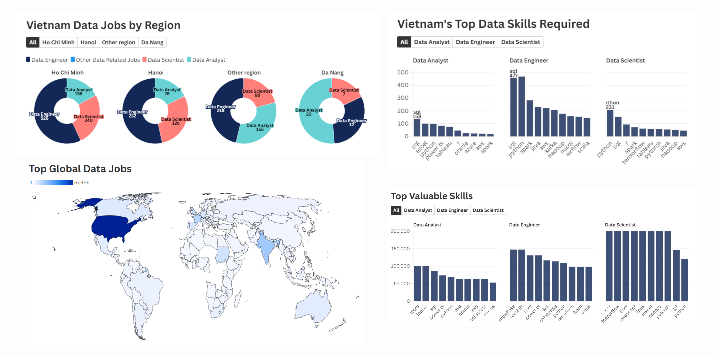
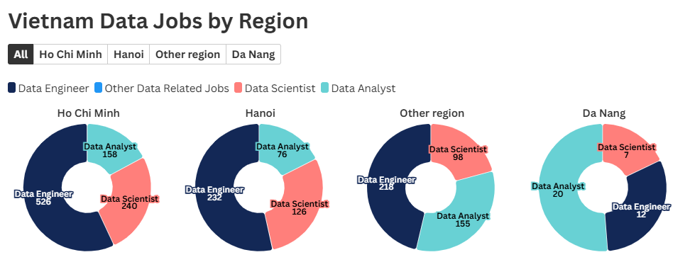
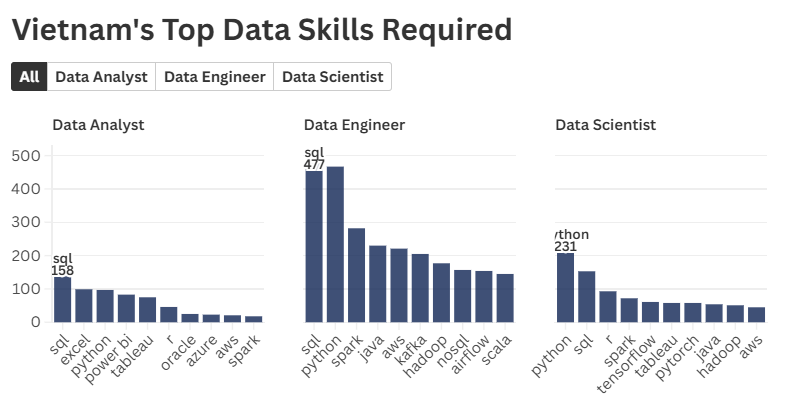

# Vietnam Data Jobs Market




## Key Findings

- Data Engineer, Data Scientist, and Data Analyst accounted for 31.7%, 15.6%, and 13.9% respectively of Vietnam data job postings.
- Ho Chi Minh City has the highest number of job postings for data related positions.
- Data Engineer is most demanded by Bosch Group, and KMS Technology; while, Data Analyst is inquired by Ninja Van, Geo Comply, Publicis Groupe, and Bosch Group. 
- All 3 jobs require SQL, and Python as one of the most important skills, following with several skills specified by each role:
    - Data Engineer: SQL, Python, Spark, Java, and other large database skills.
    - Data Analyst: SQL, Excel, Python, and visualization tools.
    - Data Scientist: Python, SQL, R, Spark, visualization tools, and large database skills.
- Besides, the following skills are also valuable and might offer more opportunies for individuals:
    - Data Engineer: **Snowflake** - Power BI, SQL, Python, Excel.
    - Data Analyst: **Word, Looker and SQL** - Power BI, Python, Java.
    - Data Scientist: **C++, Tensorflow, Javascript, Linux** - Python, Java, Tableau.

## Background and Description 
- **Objective:** This project was developed to understand more profoundly the data jobs market in Vietnam through the findings of top-paid and in-demand skills for these roles.
- **Main questions through these SQL queries:**

    1. Overview of global data jobs market
    2. What are the top data jobs?
    3. What skills are required for these jobs?
    4. Which skills are the most valuable?

- **Data Description:**
    - The dataset was observed in 2023 with 787,686 total job postings across the world.
    - The data consists of 4 tables: company_dim, job_postings_fact, skills_dim, and skills_job_dim.
    - The insights are on job titles, locations, salaries, and important skills.


## Data Jobs Market Overview
### Countries with highest job postings


<details>
    <summary><strong>Show hidden SQL code</strong></summary>
    <br>

```sql
SELECT 
    job_country,
    COUNT(job_id) AS job_count,
    ROUND(AVG(salary_year_avg), 2) AS avg_salary
FROM job_postings_fact
WHERE 
    job_country IS NOT NULL
GROUP BY job_country
ORDER BY job_count DESC     
```


</details>

<div align="center">

### Top demanded roles in leading countries
| Country | Job Title | Job Count | Average Salary |
|---|---|---|---|
| United States | Data Analyst | 67956 | 94503.55 |
| India | Data Engineer | 19095 | 123312.39 |
| France | Data Analyst | 13855 | 82156.34 |
| United Kingdom | Data Engineer | 11828 | 115717.49 |
| Sudan | Data Scientist | 8474 | 136385.76 |
| Germany | Data Analyst | 7141 | 101563.06 |
| Spain | Data Engineer | 6766 | 117345.25 |
| Singapore | Data Analyst | 6642 | 94730.77 |
| Netherlands | Data Engineer | 6604 | 107600.65 |
| Canada | Data Engineer | 5839 | 119215.58 |

</div>

<details>
    <summary><strong>Show hidden SQL code</strong></summary>
    <br>

```sql
SELECT 
    job_country,
    job_title_short,
    job_count,
    avg_salary
FROM (
    SELECT 
        job_country,
        job_title_short,
        COUNT(job_id) AS job_count,
        ROUND(AVG(salary_year_avg), 2) AS avg_salary,
        CASE
            WHEN COUNT(job_id) = MAX(COUNT(job_id)) OVER (PARTITION BY job_country) THEN 'Top Job'
            ELSE 'Other Jobs'
        END AS top_jobs
    FROM job_postings_fact
    WHERE 
        job_country IS NOT NULL
    GROUP BY job_country,
        job_title_short
    ORDER BY job_count DESC 
) 

WHERE 
    job_country IS NOT NULL
    AND top_jobs = 'Top Job'
GROUP BY job_country, job_title_short, job_count, avg_salary
ORDER BY job_count DESC 
```

</details>

- The USA remains the highest number of data job postings with approximately more than 200,000 job postings, in which Data Analyst is the highest demand.
- India and Europe shows a growing demand for these roles with Data Engineer and Data Analyst respectively.
- The data job is concentrated in North America, along with significant opportunities in the Europe, and around Asia.

## Insights Summary

### 1. Vietnam Data Market


<details>
    <summary><strong>Show hidden SQL code</strong></summary>
    <br>

```sql
SELECT 
    job_title_short,
    COUNT(job_id) AS job_count,
    ROUND(AVG(salary_year_avg), 2) AS avg_salary
FROM job_postings_fact
WHERE 
    job_country IS NOT NULL
    AND job_country = 'Vietnam'
GROUP BY job_country,
    job_title_short
ORDER BY job_count DESC 
```

</details>

<div align="center">

| Job Count | Average Salary | Region |
|---|---|---|
| 1219 | 110977.792 | Ho Chi Minh |
| 658 | 73269.548 | Other region |
| 546 | 111175.000 | Hanoi |

</div>

<details>
    <summary><strong>Show hidden SQL code</strong></summary>
    <br>

```sql
SELECT
    COUNT(job_id) AS vn_jobs,
    ROUND(AVG(salary_year_avg), 3) AS vn_avg_salary,
    CASE 
        WHEN job_location LIKE '%Ho Chi Minh%' THEN 'Ho Chi Minh'
        WHEN job_location LIKE '%Hanoi%' THEN 'Hanoi'
        WHEN job_location LIKE '%Da Nang%' THEN 'Da Nang'
        ELSE 'Other region'
    END AS region
FROM job_postings_fact
WHERE 
    job_country = 'Vietnam'
GROUP BY region
ORDER BY vn_jobs DESC
```

</details>

- Vietnam had a high demand for data engineer, data scientist, and data analyst, in which accounted for 31.7%, 15.6%, 13.9% respectively.
- Ho Chi Minh has the highest number of data job postings in Vietnam, accounting for 1219 jobs.
- Hanoi and other regions took up an amount of 546 and 658 job postings respectively.


### 2. Top Data Jobs

*(Kindly click on the images for interactive charts)*

#### Data jobs demand in Vietnam by region

<a href="https://public.flourish.studio/visualisation/25799025/" target="_blank">
    
  </a>

<details>
    <summary><strong>Show hidden SQL code</strong></summary>
    <br>

```sql
SELECT
    CASE 
        WHEN job_title_short LIKE '%Data Engineer%' THEN 'Data Engineer'
        WHEN job_title_short LIKE '%Data Analyst%' THEN 'Data Analyst'
        WHEN job_title_short LIKE '%Data Scientist%' THEN 'Data Scientist'
        ELSE 'Other Data Related Jobs'
    END AS title,
    COUNT(job_id) AS job_count,
    CASE 
        WHEN job_location LIKE '%Ho Chi Minh%' THEN 'Ho Chi Minh'
        WHEN job_location LIKE '%Hanoi%' THEN 'Hanoi'
        WHEN job_location LIKE '%Da Nang%' THEN 'Da Nang'
        ELSE 'Other region'
    END AS region,
    ROUND(AVG(salary_year_avg), 2) AS avg_salary
FROM job_postings_fact
WHERE job_country = 'Vietnam'
GROUP BY title, region
ORDER BY job_count DESC;
```

</details>

#### Top data jobs demand from leading companies in Vietnam

<p align="center">
  <a href="https://public.flourish.studio/visualisation/25781987/" target="_blank">
    
  </a>
  <a href="https://public.flourish.studio/visualisation/25781987/" target="_blank">
    
  </a>
</p>

<p align="center">
  <a href="https://public.flourish.studio/visualisation/25781987/" target="_blank">
    
  </a>
  <a href="https://public.flourish.studio/visualisation/25781987/" target="_blank">
    
  </a>
</p>

<details>
    <summary><strong>Show hidden SQL code</strong></summary>
    <br>

```sql
SELECT 
    name AS company_name,
    job_title_short,
    COUNT(job_id) AS job_count,
    ROUND(AVG(salary_year_avg), 2) AS avg_salary
FROM job_postings_fact
    LEFT JOIN company_dim ON job_postings_fact.company_id = company_dim.company_id
WHERE 
    job_country = 'Vietnam'
    AND salary_year_avg IS NOT NULL
GROUP BY name, job_title_short
ORDER BY job_count DESC;
```

</details>

- The top 3 data jobs are most from Ho Chi Minh City, with the salary ranging from $40,000 to $200,000.
- Data engineer is most demanded by Bosch Group, and KMS Technology. Yet, data analyst is inquired by Ninja Van, Geo Comply, Publicis Groupe, and Bosch Group. This is because the nature of the companies.

    <details>
    <summary><strong>Further explanations about companies</strong></summary>
    <br>

    - **Bosch Group:**
        - A multinational engineering and technology company. Core areas include automotive parts, industrial technology, consumer goods, and Smart Home/IoT devices.
        - **Data Engineers:** build and maintain the large-scale data pipelines and cloud infrastructure required to handle the massive, continuous data streams generated by their IoT devices, manufacturing processes, and global operations.
        - **Data Analysts:** interpret the sales, financial, and market data to inform business strategy, R&D spending, and regional product launches.

    - **KMS Technology:**
        - A global technology consulting and software development company. They build software platforms and digital solutions for other businesses.
        - **Data Engineers:** design, implement, and optimize robust data warehouses and data lakes for their clients' products. Their business is building the technology that others use to process and store data.

    - **Ninja Van:**
        - A major logistics and e-commerce delivery company across Southeast Asia.	
        - **Data Analysts:** optimize operational efficiency. Analysts study delivery routes, sortation center performance, failure rates, and customer behavior to reduce costs and improve delivery speed.

    - **Publicis Groupe:**
        - One of the world's largest advertising and public relations firms (a holding company).	
        - **Data Analysts:** measure campaign performance, analyze audience data, and forecast marketing trends. Analysis is essential to prove the ROI (Return on Investment) of ad campaigns to their clients.

    </details>

- While Bosch Group has a high number of job postings for both data roles, the average salaries are behind several other businesses, such as KMS Technology, Trusting Social, and Pulicis Groupe.

### 3. Skills Required

*(Kindly click on the images for interactive charts)*

<a href="https://public.flourish.studio/visualisation/25788452/" target="_blank">
    
  </a>

<details>
    <summary><strong>Show hidden SQL code</strong></summary>
    <br>

```sql
-- Data Analyst
SELECT 
    job_title_short,
    skills_dim.skills,
    COUNT(skills_job_dim.job_id) AS skills_count
FROM job_postings_fact
    INNER JOIN skills_job_dim ON job_postings_fact.job_id = skills_job_dim.job_id
    INNER JOIN skills_dim ON skills_job_dim.skill_id = skills_dim.skill_id
WHERE job_title_short = 'Data Analyst'
    AND job_country = 'Vietnam'
GROUP BY skills_dim.skill_id,
    skills_dim.skills, job_title_short
ORDER BY skills_count DESC
LIMIT 10;


-- Data Engineer
SELECT 
    job_title_short,
    skills_dim.skills,
    COUNT(skills_job_dim.job_id) AS skills_count
FROM job_postings_fact
    INNER JOIN skills_job_dim ON job_postings_fact.job_id = skills_job_dim.job_id
    INNER JOIN skills_dim ON skills_job_dim.skill_id = skills_dim.skill_id
WHERE job_title_short = 'Data Engineer'
    AND job_country = 'Vietnam'
GROUP BY skills_dim.skill_id,
    skills_dim.skills, job_title_short
ORDER BY skills_count DESC
LIMIT 10;


-- Data Scientist
SELECT 
    job_title_short,
    skills_dim.skills,
    COUNT(skills_job_dim.job_id) AS skills_count
FROM job_postings_fact
    INNER JOIN skills_job_dim ON job_postings_fact.job_id = skills_job_dim.job_id
    INNER JOIN skills_dim ON skills_job_dim.skill_id = skills_dim.skill_id
WHERE job_title_short = 'Data Scientist'
    AND job_country = 'Vietnam'
GROUP BY skills_dim.skill_id,
    skills_dim.skills, job_title_short
ORDER BY skills_count DESC
LIMIT 10;
```

</details>


- **Data Engineer:** SQL, Python, Spark, Java, and other large database skills.
- **Data Analyst:** SQL, Excel, Python, and visualization tools.
- **Data Science:** Python, SQL, R, Spark, visualization tools, and large database skills.
- Data Engineer, Data Analyst, and Data Scientist required SQL, and Python skills as one of the most important skill, with excel, and other data visualization tools such as power bi and tableau.


### 4. High Offered Salary Skills

*(Kindly click on the images for interactive charts)*

<a href="https://public.flourish.studio/visualisation/25799859/" target="_blank">
    
  </a>

<details>
    <summary><strong>Show hidden SQL code</strong></summary>
    <br>

```sql
-- Data Analyst
SELECT 
    job_title_short,
    skills_dim.skills,
    ROUND(AVG(salary_year_avg), 0) AS avg_salary
FROM job_postings_fact
    INNER JOIN skills_job_dim ON job_postings_fact.job_id = skills_job_dim.job_id
    INNER JOIN skills_dim ON skills_job_dim.skill_id = skills_dim.skill_id
WHERE job_title_short = 'Data Analyst'
    AND salary_year_avg IS NOT NULL
    AND job_country = 'Vietnam'
GROUP BY skills_dim.skills, job_title_short
ORDER BY avg_salary DESC;


-- Data Engineer
SELECT 
    job_title_short,
    skills_dim.skills,
    ROUND(AVG(salary_year_avg), 0) AS avg_salary
FROM job_postings_fact
    INNER JOIN skills_job_dim ON job_postings_fact.job_id = skills_job_dim.job_id
    INNER JOIN skills_dim ON skills_job_dim.skill_id = skills_dim.skill_id
WHERE job_title_short = 'Data Engineer'
    AND salary_year_avg IS NOT NULL
    AND job_country = 'Vietnam'
GROUP BY skills_dim.skills, job_title_short
ORDER BY avg_salary DESC;


-- Data Scientist
SELECT 
    job_title_short,
    skills_dim.skills,
    ROUND(AVG(salary_year_avg), 0) AS avg_salary
FROM job_postings_fact
    INNER JOIN skills_job_dim ON job_postings_fact.job_id = skills_job_dim.job_id
    INNER JOIN skills_dim ON skills_job_dim.skill_id = skills_dim.skill_id
WHERE job_title_short = 'Data Scientist'
    AND salary_year_avg IS NOT NULL
    AND job_country = 'Vietnam'
GROUP BY skills_dim.skills, job_title_short
ORDER BY avg_salary DESC;
```

</details>

- **Data Engineer:** Snowflake is the highest paid salary skills that is vital for data engineer. This is followed by other database skills, Power BI, SQL, Python, and Excel, ranging from $45,000 to $147,500.
- **Data Analyst:** Word, Looker and SQL are the most valuable skills with the salary ranged from $86,533 to $100,500, along with Power BI, Python, and Java.
- **Data Scientist:** The most important skills for this roles is C++, Javascript, and other tools that is vital for machine learning. Python, Java, and some visualization tools are also needed. These skills are paid within the $50,000 - $200,000 range.


## Tools Used
- **SQL:** The main tool used for extracting, and arranging necessary data for further analysis.
- **PostgreSQL:** The database management system for handling this dataset.
- **Python:** Used for analyzing the extracted dataset, and visualizing charts.
- **Flourish Studio:** Online visualization tools for quick charts illustrations.
- **Visual Studio Code:** Used for database management, the execution of SQL queries, and Python analysis.
- **Git & GitHub:** Essential for version control and sharing SQL and Python scripts along with the analysis ensuring collaboration, and project tracking.