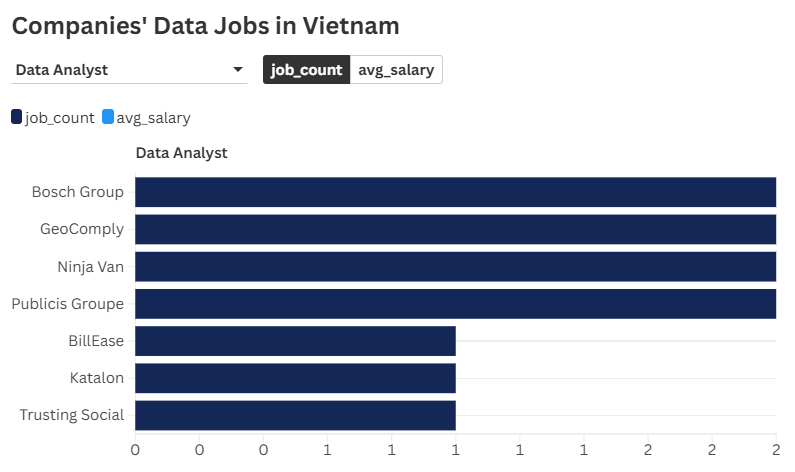

# Vietnam Data Related Jobs Market

#### (charts summary of the findings)

## Key Findings

## Background and Description 
- **Objective:** This project was developed to understand more profoundly the data analyst market through the findings of top-paid and in-demand skills for these roles.
- **Main questions through these SQL queries:**

    1. Overview of global data jobs market
    2. What are the top-paying data analyst jobs?
    3. What skills are required for these jobs?
    4. What skills are most in demand for data analyst?
    5. Which skills are associated with higher salaries?
    6. What are the most optimal skills to learn? 

- **Data Description:**
    - The dataset was observed in 2023 with ... jobs across the world.
    - The data consists of 4 tables: company_dim, job_postings_fact, skills_dim, and skills_job_dim.
    - The insights are on job titles, locations, salaries, and important skills.

## Data Jobs Market Overview
### Countries with highest job postings

### Top demanded roles in leading countries
| Country | Job Title | Job Count | Average Salary |
|---|---|---|---|
| United States | Data Analyst | 67956 | 94503.55 |
| India | Data Engineer | 19095 | 123312.39 |
| France | Data Analyst | 13855 | 82156.34 |
| United Kingdom | Data Engineer | 11828 | 115717.49 |
| Sudan | Data Scientist | 8474 | 136385.76 |
| Germany | Data Analyst | 7141 | 101563.06 |
| Spain | Data Engineer | 6766 | 117345.25 |
| Singapore | Data Analyst | 6642 | 94730.77 |
| Netherlands | Data Engineer | 6604 | 107600.65 |
| Canada | Data Engineer | 5839 | 119215.58 |

- The USA remains the highest number of data job postings with approximately more than 200,000 job postings, in which Data Analyst is the highest demand.
- India and Europe shows a growing demand for these roles with Data Engineer and Data Analyst respectively.
- The data job is concentrated in North America, along with significant opportunities in the Europe, and around Asia.

## Insights Summary

### 1. Vietnam Data Market

| Job Count | Average Salary | Region |
|---|---|---|
| 1219 | 110977.792 | Ho Chi Minh |
| 658 | 73269.548 | Other region |
| 546 | 111175.000 | Hanoi |

- Vietnam had a high demand for data engineer, data scientist, and data analyst, in which accounted for 31.7%, 15.6%, 13.9% respectively.
- Ho Chi Minh has the highest number of data job postings in Vietnam, accounting for 1219 jobs.
- Hanoi and other regions took up an amount of 546 and 658 job postings respectively.

### 2. Top-paying data analyst jobs

*(Kindly click on the images for interactive charts)*

  
  

  
  

- Most of the top-paying data jobs are data engineer and data analyst, locating in Ho Chi Minh City, with the salary range from $40,000 to $200,000.
- Data engineer is most demanded by Bosch Group, and KMS Technology. Yet, Data analyst is inquired by Ninja Van, Geo Comply, Publicis Groupe, and Bosch Group. This is because the nature of the companies.

    

    
<strong>Click to see explanations about companies</strong>

     

    - **Bosch Group:**
        - A multinational engineering and technology company. Core areas include automotive parts, industrial technology, consumer goods, and Smart Home/IoT devices.
        - **Data Engineers:** build and maintain the large-scale data pipelines and cloud infrastructure required to handle the massive, continuous data streams generated by their IoT devices, manufacturing processes, and global operations.
        - **Data Analysts:** interpret the sales, financial, and market data to inform business strategy, R&D spending, and regional product launches.

    - **KMS Technology:**
        - A global technology consulting and software development company. They build software platforms and digital solutions for other businesses.
        - **Data Engineers:** design, implement, and optimize robust data warehouses and data lakes for their clients' products. Their business is building the technology that others use to process and store data.

    - **Ninja Van:**
        - A major logistics and e-commerce delivery company across Southeast Asia.	
        - **Data Analysts:** optimize operational efficiency. Analysts study delivery routes, sortation center performance, failure rates, and customer behavior to reduce costs and improve delivery speed.

    - **Publicis Groupe:**
        - One of the world's largest advertising and public relations firms (a holding company).	
        - **Data Analysts:** measure campaign performance, analyze audience data, and forecast marketing trends. Analysis is essential to prove the ROI (Return on Investment) of ad campaigns to their clients.

    

- While Bosch Group has a high number of job postings for both data roles, the average salaries are behind several other businesses, such as KMS Technology, Trusting Social, and Pulicis Groupe.

### 3. Skills Required

- (draw charts for comparing the required skills for each of the three job types)
- **Data Engineer:** SQL, Python, Spark, Java, and other large database skills.
- **Data Analyst:** SQL, Excel, Python, and visualization tools.
- **Data Science:** Python, SQL, R, Spark, visualization tools, and large database skills.
- Data Engineer and Data Analyst required SQL, and Python skills as one of the most important skill, with excel, and other data visualization tools such as power bi and tableau.
- Data Scientist, however, 

### 4. High Offered Salary Skills

- **Data Engineer:** Snowflake is the highest paid salary skills that is vital for data engineer. This is followed by other database skills, Power BI, SQL, Python, and Excel, ranging from $45,000 to $147,500.
- **Data Analyst:** Word, Looker and SQL are the top-paying skills with the salary ranged from $86,533 to $100,500, along with Power BI, Python, and Java.
- **Data Scientist:** The most important skills for this roles is C++, Javascript, and other tools that is vital for machine learning. Python, Java, and some visualization tools are also needed. These skills are paid within the $50,000 - $200,000 range.

#### By companies

### 5. Optimal Skills 

- **Data Analyst:** SQL is the most necessary in business since 8 out of 10 of the companies required this skills, following with power bi and python.
- **Data Engineer:** Spark is the most important for this role, following with SQL and Python.
- **Data Scientist:** Python and Java is required when applying since ...

## Tools Used
- **SQL:** The main tool used for extracting, and ordering necessary data for further analysis.
- **PostgreSQL:** The database management system for handling this dataset.
- **Python:** Used for analyzing the extracted dataset, and visualizing charts.
- **Visual Studio Code:** Used for database management, the execution of SQL queries, and Python analysis.
- **Git & GitHub:** Essential for version control and sharing SQL and Python scripts along with the analysis, ensuring collaboration, and project tracking.

## Recommendation
